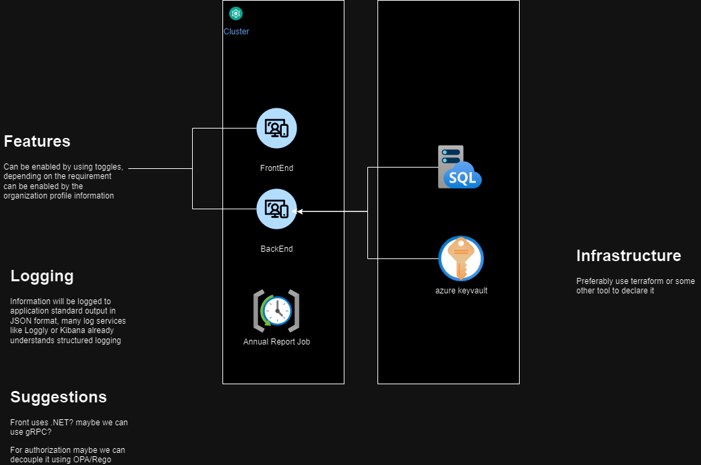

# Introduction 
This repository is the code challenge answer for the BlueCoding Interview

# Please Notice
1. A UI was not implemented, wasn't relevant for the code challenge
1. Integration with queues, webhooks, API's wasn't implementeed, that is trivial and usually is just a matter of consume an SDK consume o emit messages, request or consume responses from an API.
1. There are some other documentation in the diagram of this repository.
1. For federated identities we could implement it via OAuth 2.0 or by using Microsoft Identity Platform.

# Diagram
